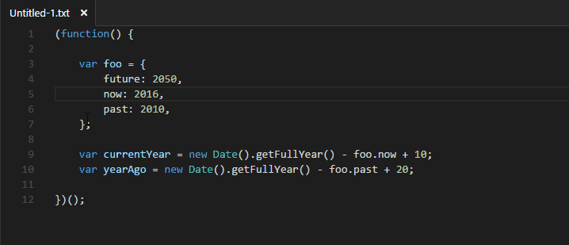

# Alignment

## Functionality

This extension align chars in selection. It helps creating clean, formatted code.

Select text and press `Alt+=` (on macOS `Option+=`). You can also use context menu commend.

## Extension Settings

This extension contributes the following settings:

* `alignment.chars`: pairs chars and their space settings

Space settings:

* `spaceBefore`: spaces count before char,
* `spaceAfter`: spaces count after char.

## Shortcuts

* Windows/Linux: `Alt+=`
* macOS: `Option+=`

# Updates

## 0.2.3

* Changed category to Formatters.

## 0.2.0

* Add context menu option.
* Describe shortcuts in README

## 0.1.0

* Fixed alignment to 2 chars string.
* Alignment many chars in line to table.